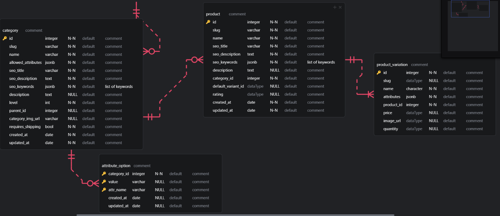

# Dev Log

---

The project was generated using [fastapi_template](https://github.com/s3rius/FastAPI-template).
Features included from the template generator

-   Redis support
-   Migrations
-   Kubernetes config
-   Prometheus (this adds a /metrics endpoint)
-   Loguru
-   Opentelemetry
-   Kafka
-   gunicorn server

This is the erd.

Detailed attributes of the Entities can be found in the [Documentation][docs]

[docs]: Doc.md

The Category class is a tree, for the implementation, i desided to go with Adjacency List with CTE. My decision was based off this videos [ [1](https://www.youtube.com/watch?v=CRxjoklS8v0) and [2](https://www.youtube.com/watch?v=3WXiCT6jurk)]. This [article](https://www.postgresqltutorial.com/postgresql-tutorial/postgresql-recursive-query/) was referenced in the second video.
